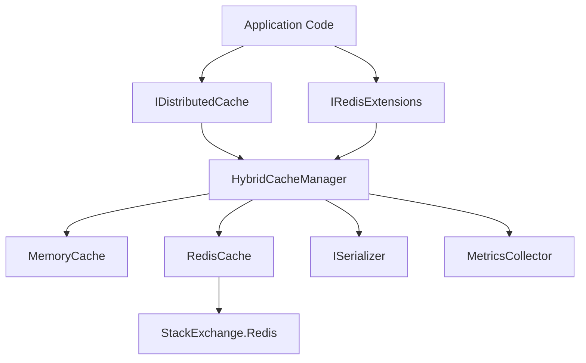

# Design Document

## Overview

本设计文档描述了一个基于 .NET 8 的分布式缓存系统的架构和实现细节。该系统实现了 Microsoft 的 `IDistributedCache` 接口，同时提供了 Redis 特有功能的扩展接口，并集成了二级本地缓存以提升性能。

系统采用分层架构设计：
- **接口层**：提供标准的 IDistributedCache 接口和扩展的 Redis 功能接口
- **缓存层**：实现二级缓存逻辑（本地缓存 + Redis）
- **存储层**：Redis 客户端封装和连接管理
- **序列化层**：支持字节数组和强类型对象的序列化

## Architecture

### 系统架构图



### 核心组件

1. **HybridCacheManager**: 主要的缓存管理器，协调本地缓存和 Redis 缓存
2. **MemoryCache**: 基于 `Microsoft.Extensions.Caching.Memory` 的本地缓存实现
3. **RedisCache**: Redis 客户端封装，使用 `StackExchange.Redis`
4. **SerializationProvider**: 序列化/反序列化提供者
5. **MetricsCollector**: 性能指标收集器

## Components and Interfaces

### IDistributedCache 实现

```csharp
public class HybridDistributedCache : IDistributedCache
{
    byte[]? Get(string key);
    Task<byte[]?> GetAsync(string key, CancellationToken token = default);
    void Set(string key, byte[] value, DistributedCacheEntryOptions options);
    Task SetAsync(string key, byte[] value, DistributedCacheEntryOptions options, CancellationToken token = default);
    void Refresh(string key);
    Task RefreshAsync(string key, CancellationToken token = default);
    void Remove(string key);
    Task RemoveAsync(string key, CancellationToken token = default);
}
```

### Redis 扩展接口

```csharp
public interface IRedisExtensions
{
    // Hash operations
    Task<bool> HashSetAsync(string key, string field, byte[] value);
    Task<byte[]?> HashGetAsync(string key, string field);
    Task<Dictionary<string, byte[]>> HashGetAllAsync(string key);
    Task<bool> HashDeleteAsync(string key, string field);
    
    // List operations
    Task<long> ListPushAsync(string key, byte[] value);
    Task<byte[]?> ListPopAsync(string key);
    Task<long> ListLengthAsync(string key);
    
    // Set operations
    Task<bool> SetAddAsync(string key, byte[] value);
    Task<bool> SetRemoveAsync(string key, byte[] value);
    Task<byte[][]> SetMembersAsync(string key);
    
    // Sorted Set operations
    Task<bool> SortedSetAddAsync(string key, byte[] value, double score);
    Task<byte[][]> SortedSetRangeByScoreAsync(string key, double min, double max);
    
    // Pub/Sub
    Task PublishAsync(string channel, byte[] message);
    Task SubscribeAsync(string channel, Action<byte[]> handler);
}
```

### 泛型扩展方法

```csharp
public static class DistributedCacheExtensions
{
    Task<T?> GetAsync<T>(this IDistributedCache cache, string key);
    Task SetAsync<T>(this IDistributedCache cache, string key, T value, DistributedCacheEntryOptions options);
}
```

### 配置选项

```csharp
public class HybridCacheOptions
{
    public string RedisConnectionString { get; set; }
    public bool EnableLocalCache { get; set; } = true;
    public int LocalCacheMaxSize { get; set; } = 1000;
    public TimeSpan LocalCacheDefaultExpiration { get; set; } = TimeSpan.FromMinutes(5);
    public TimeSpan RedisOperationTimeout { get; set; } = TimeSpan.FromSeconds(5);
    public bool EnableMetrics { get; set; } = true;
}
```

## Data Models

### CacheEntry

```csharp
internal class CacheEntry
{
    public string Key { get; set; }
    public byte[] Value { get; set; }
    public DateTimeOffset? AbsoluteExpiration { get; set; }
    public TimeSpan? SlidingExpiration { get; set; }
    public DateTimeOffset CreatedAt { get; set; }
    public DateTimeOffset LastAccessedAt { get; set; }
}
```

### CacheMetrics

```csharp
public class CacheMetrics
{
    public long TotalRequests { get; set; }
    public long CacheHits { get; set; }
    public long CacheMisses { get; set; }
    public double HitRate => TotalRequests > 0 ? (double)CacheHits / TotalRequests : 0;
    public double AverageResponseTimeMs { get; set; }
    public long LocalCacheHits { get; set; }
    public long RedisHits { get; set; }
}
```

## Correctness Properties

*A property is a characteristic or behavior that should hold true across all valid executions of a system-essentially, a formal statement about what the system should do. Properties serve as the bridge between human-readable specifications and machine-verifiable correctness guarantees.*

### Property 1: Set-Get Round Trip
*For any* valid cache key and byte array value, setting the value and then immediately getting it should return the same byte array.
**Validates: Requirements 1.1, 1.2**

### Property 2: Get Non-Existent Key Returns Null
*For any* cache key that has not been set, getting that key should return null.
**Validates: Requirements 1.3**

### Property 3: Remove Deletes Entry
*For any* cache key that has been set, removing it and then getting it should return null.
**Validates: Requirements 1.4**

### Property 4: Async Operations Equivalence
*For any* cache operation, the async version should produce the same result as the sync version.
**Validates: Requirements 2.1, 2.2, 2.3, 2.4**

### Property 5: Absolute Expiration Enforcement
*For any* cache entry with absolute expiration set, getting the key after the expiration time should return null.
**Validates: Requirements 3.1, 3.2, 3.5**

### Property 6: Sliding Expiration Reset on Access
*For any* cache entry with sliding expiration, accessing it before expiration should extend its lifetime.
**Validates: Requirements 3.3, 1.5**

### Property 7: Earlier Expiration Wins
*For any* cache entry with both absolute and sliding expiration set, the entry should expire at whichever time comes first.
**Validates: Requirements 3.4**

### Property 8: Hash Round Trip
*For any* hash key, field name, and byte array value, setting a hash field and then getting it should return the same value.
**Validates: Requirements 4.1**

### Property 9: List FIFO Behavior
*For any* list key and sequence of values, pushing values and then popping them should return values in FIFO order.
**Validates: Requirements 4.2**

### Property 10: Set Uniqueness
*For any* set key and value, adding the same value multiple times should result in the set containing that value only once.
**Validates: Requirements 4.3**

### Property 11: Sorted Set Ordering
*For any* sorted set key and values with scores, retrieving by score range should return values in ascending score order.
**Validates: Requirements 4.4**

### Property 12: Pub/Sub Message Delivery
*For any* channel and message, subscribers should receive the exact message that was published.
**Validates: Requirements 4.5**

### Property 13: Local Cache Priority
*For any* cache key present in local cache, getting it should not access Redis.
**Validates: Requirements 5.1**

### Property 14: Local Cache Population
*For any* cache key not in local cache but in Redis, getting it should populate the local cache.
**Validates: Requirements 5.2**

### Property 15: Dual Write Consistency
*For any* cache key and value, setting it should update both Redis and local cache.
**Validates: Requirements 5.3**

### Property 16: Dual Remove Consistency
*For any* cache key, removing it should delete from both Redis and local cache.
**Validates: Requirements 5.4**

### Property 17: Local Cache Size Limit
*For any* configured maximum size, the local cache should never exceed that number of entries.
**Validates: Requirements 6.1**

### Property 18: LRU Eviction
*For any* full local cache, adding a new entry should evict the least recently used entry.
**Validates: Requirements 6.2**

### Property 19: Redis Failure Degradation
*For any* cache key in local cache, when Redis is unavailable, getting the key should still return the cached value.
**Validates: Requirements 7.1**

### Property 20: Redis Failure Exception
*For any* cache operation when Redis is unavailable and local cache is disabled, the operation should throw a clear exception.
**Validates: Requirements 7.2**

### Property 21: Service Registration
*For any* service collection, calling AddDistributedCache should register IDistributedCache as a resolvable service.
**Validates: Requirements 8.1, 8.4**

### Property 22: Configuration Application
*For any* provided configuration options, the cache system should behave according to those options.
**Validates: Requirements 8.2, 8.3**

### Property 23: Object Serialization Round Trip
*For any* serializable object, setting it with the generic method and getting it back should return an equivalent object.
**Validates: Requirements 9.1, 9.2, 9.3**

### Property 24: Custom Serializer Usage
*For any* custom serializer configured, the cache system should use that serializer for all serialization operations.
**Validates: Requirements 9.4**

### Property 25: Metrics Recording
*For any* cache operation, the metrics collector should record the operation type and execution time.
**Validates: Requirements 10.1**

### Property 26: Hit Rate Calculation
*For any* sequence of cache hits and misses, the reported hit rate should equal hits divided by total requests.
**Validates: Requirements 10.2, 10.3, 10.4**


## Error Handling

### Redis Connection Failures

1. **Graceful Degradation**: 当 Redis 不可用时，如果启用了本地缓存，系统应继续从本地缓存提供数据
2. **Clear Error Messages**: 当 Redis 不可用且本地缓存未启用时，抛出 `RedisConnectionException` 并包含详细的错误信息
3. **Automatic Retry**: 使用 Polly 库实现指数退避重试策略，最多重试 3 次
4. **Circuit Breaker**: 实现断路器模式，当连续失败达到阈值时暂时停止访问 Redis

### Serialization Errors

1. **Type Safety**: 在反序列化时验证类型兼容性，不兼容时抛出 `SerializationException`
2. **Null Handling**: 正确处理 null 值的序列化和反序列化
3. **Version Tolerance**: 支持向后兼容的序列化格式

### Timeout Handling

1. **Configurable Timeouts**: 所有 Redis 操作都应用配置的超时时间
2. **Cancellation Support**: 支持 CancellationToken 以允许取消长时间运行的操作
3. **Timeout Exceptions**: 超时时抛出 `TimeoutException` 并包含操作上下文信息

### Concurrency Issues

1. **Thread Safety**: 所有公共方法都应是线程安全的
2. **Race Condition Prevention**: 使用适当的锁机制防止并发访问导致的数据不一致
3. **Atomic Operations**: 利用 Redis 的原子操作保证数据一致性

## Testing Strategy

### Unit Testing

本项目将使用 **xUnit** 作为单元测试框架，配合 **Moq** 进行模拟。

单元测试将覆盖：

1. **基本操作测试**
   - 测试 Set/Get/Remove 的基本功能
   - 测试空键、空值等边界情况
   - 测试过期时间的正确设置

2. **配置测试**
   - 测试依赖注入配置的正确性
   - 测试各种配置选项的应用
   - 测试默认值的正确性

3. **错误处理测试**
   - 测试 Redis 连接失败时的行为
   - 测试序列化失败时的异常处理
   - 测试超时场景

4. **集成点测试**
   - 测试与 StackExchange.Redis 的集成
   - 测试与 Microsoft.Extensions.Caching.Memory 的集成

### Property-Based Testing

本项目将使用 **FsCheck** 作为属性测试库（C# 的主流 PBT 库）。

**配置要求**：
- 每个属性测试至少运行 100 次迭代
- 每个属性测试必须使用注释标记其对应的设计文档中的正确性属性
- 标记格式：`// Feature: distributed-cache, Property {number}: {property_text}`

**属性测试将验证**：

1. **往返属性**
   - Set-Get 往返一致性（Property 1）
   - Hash 操作往返一致性（Property 8）
   - 对象序列化往返一致性（Property 23）

2. **不变量属性**
   - 本地缓存大小限制（Property 17）
   - Set 的唯一性（Property 10）
   - Sorted Set 的排序（Property 11）

3. **状态转换属性**
   - 过期后的状态（Property 5）
   - 删除后的状态（Property 3）
   - LRU 驱逐行为（Property 18）

4. **等价性属性**
   - 同步和异步操作的等价性（Property 4）
   - 不同过期策略的组合（Property 7）

5. **降级和容错属性**
   - Redis 失败时的降级（Property 19, 20）
   - 双写一致性（Property 15, 16）

**测试数据生成器**：

FsCheck 将使用智能生成器来创建：
- 随机但有效的缓存键（非空字符串）
- 随机字节数组（各种大小）
- 随机过期时间配置（合理的时间范围）
- 随机对象（用于序列化测试）

### Integration Testing

集成测试将使用真实的 Redis 实例（通过 Docker 容器）：

1. **端到端场景测试**
   - 完整的缓存生命周期
   - 多客户端并发访问
   - 故障恢复场景

2. **性能测试**
   - 吞吐量测试
   - 延迟测试
   - 本地缓存命中率测试

### Test Organization

```
tests/
├── DistributedCache.UnitTests/
│   ├── HybridDistributedCacheTests.cs
│   ├── RedisCacheTests.cs
│   ├── SerializationTests.cs
│   └── ConfigurationTests.cs
├── DistributedCache.PropertyTests/
│   ├── CacheOperationsProperties.cs
│   ├── ExpirationProperties.cs
│   ├── RedisExtensionsProperties.cs
│   └── SerializationProperties.cs
└── DistributedCache.IntegrationTests/
    ├── EndToEndTests.cs
    └── PerformanceTests.cs
```

## Implementation Notes

### Technology Stack

- **.NET 8**: 目标框架
- **StackExchange.Redis**: Redis 客户端库（推荐版本 2.7+）
- **Microsoft.Extensions.Caching.Memory**: 本地缓存实现
- **Microsoft.Extensions.DependencyInjection**: 依赖注入
- **System.Text.Json**: 默认序列化器
- **Polly**: 弹性和瞬态故障处理
- **xUnit**: 单元测试框架
- **FsCheck**: 属性测试库
- **Moq**: 模拟框架

### Performance Considerations

1. **连接池**: 使用 StackExchange.Redis 的连接复用机制
2. **批量操作**: 支持批量 Get/Set 操作以减少网络往返
3. **压缩**: 对大值进行可选的压缩以减少网络传输和存储
4. **异步优先**: 所有 I/O 操作都提供异步版本

### Security Considerations

1. **连接加密**: 支持 TLS/SSL 连接到 Redis
2. **认证**: 支持 Redis 密码认证和 ACL
3. **敏感数据**: 不在日志中记录缓存值内容
4. **注入防护**: 验证和清理缓存键以防止注入攻击

### Monitoring and Observability

1. **结构化日志**: 使用 Microsoft.Extensions.Logging 记录关键操作
2. **指标导出**: 支持导出指标到 Prometheus/OpenTelemetry
3. **健康检查**: 实现 IHealthCheck 接口以支持健康检查端点
4. **分布式追踪**: 支持 OpenTelemetry 追踪集成

## Future Enhancements

1. **多 Redis 实例支持**: 支持主从复制和哨兵模式
2. **分片支持**: 支持 Redis Cluster 的自动分片
3. **预热机制**: 应用启动时预加载热点数据到本地缓存
4. **智能预取**: 基于访问模式预测和预取数据
5. **缓存标签**: 支持按标签批量失效缓存
